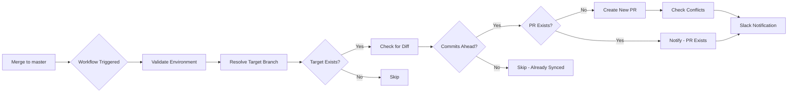

# Downstream PR

> **Automated downstream sync for multi-branch Git workflows.** Automatically creates pull requests when code is merged upstream, propagating changes through your deployment pipeline (master → uat → staging).

## 📋 Table of Contents

- [What is Downstream PR?](#what-is-downstream-pr)
- [Features](#features)
- [How It Works](#how-it-works)
- [Branch Chain](#branch-chain)
- [Quick Start](#quick-start)
- [Configuration](#configuration)
- [Slack Integration](#slack-integration)
- [Troubleshooting](#troubleshooting)
- [Example Workflow](#example-workflow)
- [Contributing](#contributing)
- [License](#license)

---

## What is Downstream PR?

**Downstream PR** is a GitHub Actions workflow that automates the propagation of code changes through your branch hierarchy. When you merge changes into an upstream branch (e.g., `master`), this workflow automatically:

1. Creates a pull request to the next downstream branch (e.g., `uat`)
2. Notifies your team via Slack
3. Detects and reports merge conflicts
4. Prevents duplicate PRs

This is ideal for teams following a **promotion-based deployment strategy** where code flows through multiple environments before reaching production.

---

## Features

✅ **Automated PR Creation** — No manual PR creation needed after merges  
✅ **Multi-Branch Chain** — Supports `master` → `uat` → `staging` (customizable)  
✅ **Slack Notifications** — Real-time alerts for PR creation, conflicts, and failures  
✅ **Conflict Detection** — Automatically flags merge conflicts in PRs and Slack  
✅ **Idempotency** — Prevents duplicate PRs if one already exists  
✅ **Retry Logic** — Handles transient API failures with exponential backoff  
✅ **User Mapping** — Mentions the correct Slack user who triggered the sync  
✅ **Labeling** — Auto-adds `automated-downstream` label for easy tracking  

---

## How It Works



### Workflow Steps

| Step | Description |
|------|-------------|
| 1. Validate | Checks for required secrets and configuration files |
| 2. User Mapping | Loads GitHub → Slack user ID mapping |
| 3. Resolve Target | Determines downstream branch based on source |
| 4. Check Diff | Verifies if target branch is already up-to-date |
| 5. Check Existing | Prevents duplicate PR creation |
| 6. Conflict Check | Detects merge conflicts on existing/new PRs |
| 7. Create PR | Opens downstream PR with detailed description |
| 8. Slack Notify | Sends formatted notification to Slack channel |

---

## Branch Chain

The default propagation chain is:

```
master ──→ uat ──→ staging
```

| Source Branch | Target Branch | Trigger Condition |
|---------------|---------------|-------------------|
| `master` | `uat` | On every push/merge to `master` |
| `uat` | `staging` | On every push/merge to `uat` |

> 💡 **Tip:** You can customize this chain by editing the `Resolve target branch` step in the workflow file.

---

## Quick Start

### Prerequisites

- GitHub repository with multiple long-lived branches
- Slack workspace with incoming webhook access (optional)
- GitHub Actions enabled

### Installation

1. **Copy the workflow file** to your repository:

   ```bash
   mkdir -p .github/workflows
   cp downstream-pr.yml .github/workflows/
   ```

2. **Create the Slack user mapping** file (optional):

   ```bash
   mkdir -p .github
   # Create .github/slack-users.json with your team's Slack IDs
   ```

3. **Configure secrets** in your GitHub repository settings:

   - Go to **Settings** → **Secrets and variables** → **Actions**
   - Add `SLACK_WEBHOOK_URL` (optional, for Slack notifications)

4. **Test the workflow** by merging a PR into `master`.

---

## Configuration

### Required Secrets

| Secret | Description | Required |
|--------|-------------|----------|
| `SLACK_WEBHOOK_URL` | Slack Incoming Webhook URL for notifications | No |

### Optional Files

| File | Description |
|------|-------------|
| `.github/slack-users.json` | Maps GitHub usernames to Slack User IDs |

**Example `.github/slack-users.json`:**

```json
{
  "kashifahmed": "UG0QWK38E",
  "johndoe": "U12345678"
}
```

**How to find your Slack User ID:**

1. Open Slack
2. Click on your profile picture (or the person's)
3. Click ⋯ (three dots) → **"Copy member ID"**
4. Add to `.github/slack-users.json`

---

## Slack Integration

### Notification Types

| Event | Trigger | Message Style |
|-------|---------|---------------|
| **PR Created** | New downstream PR opened | 🔀 Blue with "Review PR" button |
| **PR Exists** | Duplicate trigger, PR already open | 🔀 Reminder to merge |
| **Merge Conflict** | Conflicts detected on PR | 🚫 Red "View Conflicting PR" button |
| **Workflow Failed** | Any step fails | ❌ Red "View Workflow Run" button |

### Example Slack Message

```
🔀  master → uat

@kashifahmed · `abc1234`
Fix authentication bug in API gateway
Author: Kashif Ahmed

[Review PR] → (button)
```

---

## Troubleshooting

### Common Issues

#### 1. "SLACK_WEBHOOK_URL not set" warning

**Cause:** Slack webhook secret is not configured.  
**Fix:** Add `SLACK_WEBHOOK_URL` to repository secrets, or ignore if Slack notifications are not needed.

#### 2. "slack-users.json not found" warning

**Cause:** User mapping file is missing.  
**Fix:** Create `.github/slack-users.json` or ignore — Slack mentions will fall back to GitHub username.

#### 3. PR not created automatically

**Possible causes:**
- No commits ahead of target branch (already in sync)
- Source branch is not `master` or `uat` (check branch chain)
- Workflow permissions insufficient

**Fix:** Check workflow logs under **Actions** tab.

#### 4. Merge conflicts on downstream PR

**Cause:** Target branch has diverged from source.  
**Fix:** Manually resolve conflicts in the PR, or rebase the target branch.

#### 5. Duplicate PRs created

**Cause:** Rapid merges or workflow concurrency issues.  
**Fix:** The workflow includes `concurrency` groups to prevent this — check if workflow was cancelled mid-run.

---

## Example Workflow

### Scenario: Hotfix Propagation

1. Developer merges hotfix to `master`
2. **Downstream PR workflow triggers**
3. Workflow creates PR: `master` → `uat`
4. Slack notification sent to #deployments channel
5. QA team reviews and merges to `uat`
6. **Workflow triggers again**
7. New PR created: `uat` → `staging`
8. DevOps team merges to `staging` for production deployment

### Sample PR Description

```markdown
## Downstream Sync

Automated PR triggered by a merge into `master`.

- **From:** `master`
- **Into:** `uat`
- **Triggered by:** @kashifahmed
- **Original author:** Kashif Ahmed
- **Commit:** `abc1234`
- **Commit message:** Fix authentication bug in API gateway
- **Workflow run:** [View run](...)

> Merge this PR to continue the downstream chain: `uat` → next environment.

---
*Created automatically by the downstream-pr workflow.*
```

---

## Contributing

Contributions are welcome! Please:

1. Fork the repository
2. Create a feature branch (`git checkout -b feature/improvement`)
3. Commit your changes (`git commit -m 'Add new feature'`)
4. Push to the branch (`git push origin feature/improvement`)
5. Open a Pull Request

---

## License

This project is open source and available under the [MIT License](LICENSE).

---

## Related Projects

- [GitHub Actions](https://github.com/features/actions) — Automation for CI/CD
- [Slack Incoming Webhooks](https://api.slack.com/messaging/webhooks) — Send messages to Slack

---

**Made with ❤️ by Kashif Ahmed**

[](https://github.com/kashif-ahmed)
[](https://x.com/imrkash)
